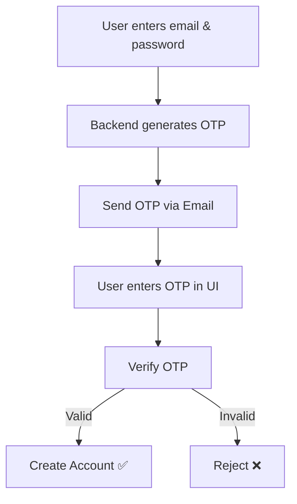

<div align="center">
   
</div>

<p align="center">
  
</p>

<h3 align="center">
  🐾 MewChat – A secure real-time chat app with email OTP signup and instant messaging
  
</h3>

<p align="center">
  <a href="https://github.com/aditya-2145/mewchat">
    
  </a>
</p>

<p align="center">
  <a href="https://github.com/aditya-2145/mewchat">
    
  </a>
</p>

---

## ✨ About MewChat  

MewChat is a **real-time chat application** built with the **MERN stack** and **Socket.IO**.  
It ensures **secure onboarding with Email OTP verification** and provides a smooth instant messaging experience.  

---

## 🛠️ Tech Stack  

#### ⚡ Frontend  
- React.js (Context API)  
- Axios  
- TailwindCSS  

#### ⚙️ Backend  
- Node.js + Express.js  
- MongoDB + Mongoose  
- JWT + bcrypt (Authentication)  
- Nodemailer (Email OTP)  

#### 🔗 Real-time  
- Socket.IO  

#### ☁️ Cloud  
- Cloudinary (for profile pictures)  

---

## 🔄 Signup Workflow  

<p align="center">
  
</p>


---

## 📸 Screenshots  

<p align="center">
  
  
</p>

<p align="center">
  
  
</p>

---

## ⚙️ Installation & Setup  

```bash
# Clone the repository
git clone https://github.com/your-username/mewchat.git
cd mewchat

# Install backend dependencies
cd server
npm install

# Install frontend dependencies
cd ../client
npm install
```

### 🔧 Environment Variables  

Create `.env` inside `server/` with:  
```env
MONGO_URI=your_mongodb_uri
JWT_SECRET=your_secret
CLOUDINARY_CLOUD_NAME=your_cloudinary_name
CLOUDINARY_API_KEY=your_cloudinary_key
CLOUDINARY_API_SECRET=your_cloudinary_secret
EMAIL_USER=your_email
EMAIL_PASS=your_email_password
```

### ▶️ Run the App  

```bash
# Start backend
cd server
npm run dev

# Start frontend
cd client
npm start
```

App runs at: **http://localhost:5000** 🎉  

---

## 🔮 Future Enhancements  
- ✅ Group chats  
- 🌙 Dark mode  
- 📞 Voice & Video calls  

---

## 📜 License  
This project is licensed under the **MIT License**.  

---

<div align="center">
   <b>🐾 MewChat – Chat made secure & simple!</b>
</div>
